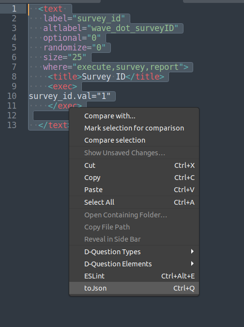

###Set up:

1.) nagivate to your sublimetext `Packages` folder
On debian based systems this is `/home/userName/.config/sublime-text-3/Packages/`

2.) clone this repository into this folder 
`git clone https://github.com/krasserp/xmlToMongoJSON.git`

3.) open a new file in sublime text 3 and you can highlight any text (XML strings) and right click to convert the xml to a JSON object.




will convert:
```
  <text 
   label="survey_id"
   altlabel="wave_dot_surveyID"
   optional="0"
   randomize="0"
   size="25"
   where="execute,survey,report">
    <title>Survey ID</title>
    <exec>
survey_id.val="1"
    </exec>

  </text>
```

to 
```
{
    type:'text',
    value:"  <text \n   label='survey_id'\n   altlabel='wave_dot_surveyID'\n   optional='0'\n   randomize='0'\n   size='25'\n   where='execute,survey,report'>\n    <title>Survey ID</title>\n    <exec>\nsurvey_id.val='1'\n    </exec>\n\n  </text>",
    id:'',
    local:['US'],
    lang:['en','es'],
    translations:[],
    dynamic:false
},
```